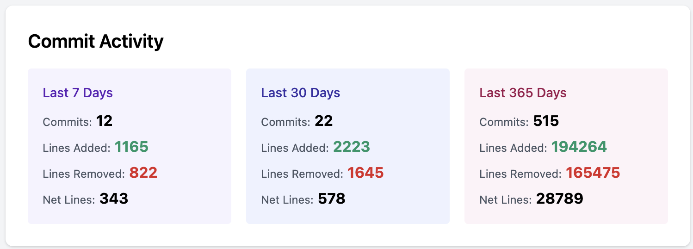
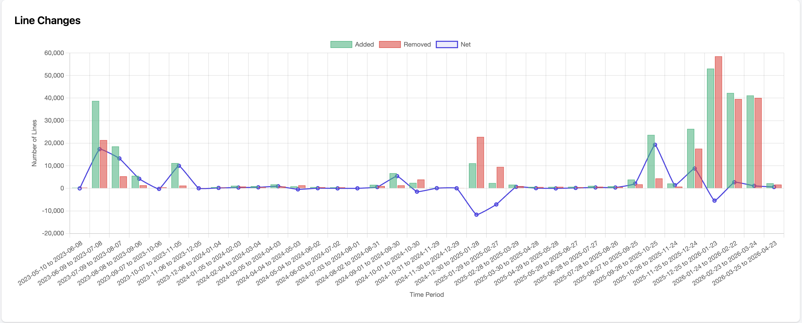
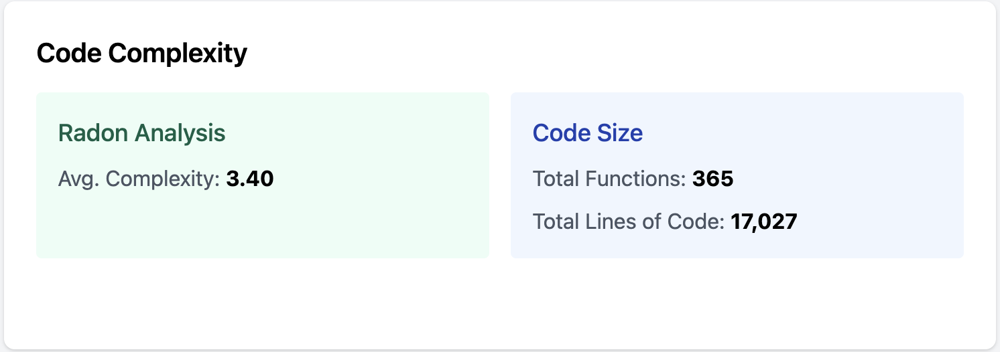
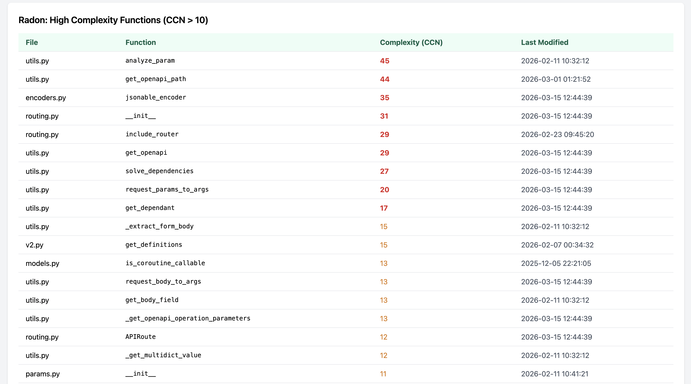
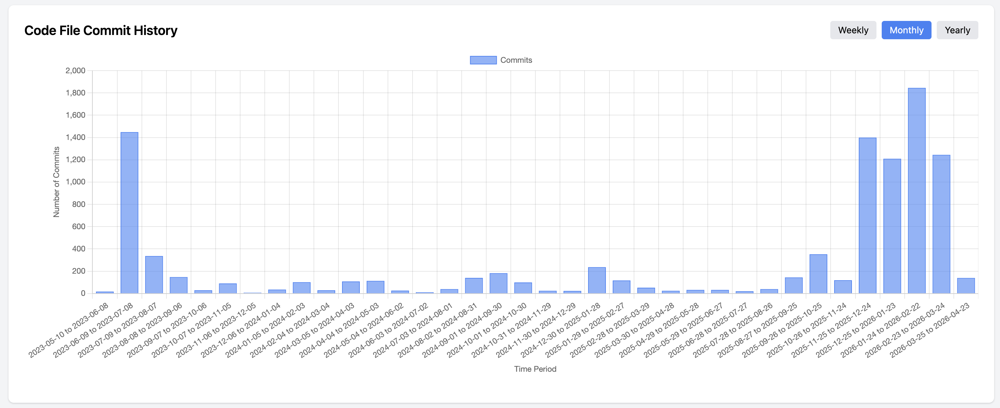

# localytics

A self-hosted code-progress dashboard. A local FastAPI server analyses a
codebase on your machine (commit activity, cyclomatic complexity, file-type
mix) and pushes the results to a small cloud dashboard you can hit from
anywhere.

## Live demo

A demo instance is running at <https://localytics-tae6.onrender.com/?key=8cdb1fa5cf9d6a275a82fc5dd8bdf40e>
currently analysing `tiangolo/fastapi`. The read-only API key is embedded in
the URL so the dashboard loads automatically with no copy-paste step.

If you'd rather paste the key by hand, open <https://localytics-tae6.onrender.com>
and enter this read-only key into the **API Key** field at the top of the
dashboard, then click **Load data**:

```text
8cdb1fa5cf9d6a275a82fc5dd8bdf40e
```

## Screenshots







## Layout

```
localytics/
├── server/      Local FastAPI server that scans your code and serves metrics
├── dashboard/   Cloud FastAPI app that caches and displays the metrics
└── helpers/     Config template + macOS launchers (LaunchAgent / .command)
```

## Quick start

Requires [`uv`](https://docs.astral.sh/uv/) — that's the only tool you need;
Python, the venv, and every dependency are fetched on demand via the PEP 723
header at the top of `server/local_server.py`.

1. **Configure.** Copy the template and fill it in:

   ```bash
   cp helpers/config.example.json helpers/config.json
   ```

   Open `helpers/config.json` and edit the following fields:

   - `LOCAL_API_KEY` and `CLOUD_API_KEY` — two random hex strings. Either
     generate them locally with `openssl rand -hex 16` (run twice for two
     distinct values), or let Render generate them for you when you set
     up env vars in step 4 (click the **Generate** button next to each
     field) and copy the values back here. Both sides must end up with
     the same strings.
   - `CODE_PATH` — the codebase you want analysed. Absolute path on your
     machine, or a subpath within a cloned GitHub repo (see
     [local vs GitHub](#workflow-local-codebase-vs-github-repo)).
   - `REPO_PATH` — the git repo that contains `CODE_PATH`. Absolute path or
     a `.git` URL.

   Leave `CLOUD_SERVER_URL` as the placeholder for now — it gets updated
   in step 5 once the Render dashboard is live. `helpers/config.json` is
   gitignored so your real keys never commit.

2. **Generate a TLS cert pair.** TLS is a security measure: it encrypts
   the API-key headers used to authenticate between the local server and
   the cloud dashboard, so the keys can't be sniffed off the network.
   Plain HTTP is only safe if the local server is reachable from
   `localhost` alone.

   ```bash
   openssl req -x509 -newkey rsa:4096 -nodes -sha256 -days 365 \
     -keyout cert.key -out cert.pem -subj "/CN=localhost"
   ```

   The defaults in `config.example.json` (`./cert.key`, `./cert.pem`)
   match the files produced above. `*.key` / `*.pem` are gitignored so
   the certs never commit.

3. **Run the local server:**
   ```bash
   uv run server/local_server.py
   ```
   First run downloads Python 3.12 + deps into uv's cache (~30–60s), then
   starts on port `51515`. TLS is on if `SSL_KEYFILE` / `SSL_CERTFILE`
   point at a valid cert pair; otherwise plain HTTP.

4. **Deploy the cloud dashboard to Render.** Two Render services are
   needed: a Key Value (Redis) store for caching, and a Web Service for
   the dashboard itself. Put them both in the same region — the Key
   Value's Internal URL only resolves to services in the same region.

   1. Push this repo to GitHub (public or private — Render's GitHub App can
      read private repos you grant it access to).
   2. Sign up at https://render.com and connect your GitHub repo. (Or use
      Render's "Public Git repository" option — no GitHub App needed, but
      you lose auto-deploy on push.)
   3. **Service 1 — Render → + New → Key Value.** Name it, pick a region,
      Free plan. Once provisioned, open the service and copy the
      **Internal Redis URL** (starts with `redis://red-…`).
   4. **Service 2 — Render → + New → Web Service.** Pick the `localytics`
      repo, **same region as Service 1**, then:

      | Field | Value |
      |---|---|
      | Root Directory | `dashboard` |
      | Runtime | Python 3 |
      | Build Command | `pip install -r requirements.txt` |
      | Start Command | `uvicorn main:app --host 0.0.0.0 --port $PORT` |
      | Health Check Path | `/health_check` |
      | Plan | Free |

      Under **Environment Variables** add four entries:

      | Key | Value |
      |---|---|
      | `LOCAL_API_KEY` | same string as in your local `helpers/config.json` |
      | `CLOUD_API_KEY` | same string as in your local `helpers/config.json` |
      | `LOCAL_SERVER_PORT` | `51515` |
      | `REDIS_URL` | Internal Redis URL from step 3 |
      | `CLOUD_READ_KEY` | *(optional, only for public demos)* a second hex string, distinct from `CLOUD_API_KEY`. Grants GET-only access to dashboard endpoints. Safe to publish. |

   5. When the deploy log shows `Uvicorn running on …` and no tracebacks,
      click the public URL at the top of the Web Service's page (ends in
      `.onrender.com`). You should see the dashboard UI with empty chart
      placeholders — that's the correct empty state before the local
      server starts pushing data.

5. **Connect local → cloud.**

   1. In Render, open your Web Service. At the top of the page, copy the
      public URL (ends in `.onrender.com`).
   2. Open `helpers/config.json` and replace the `CLOUD_SERVER_URL`
      placeholder with that URL (no trailing slash):

      ```json
      "CLOUD_SERVER_URL": "https://your-service-name.onrender.com"
      ```

   3. Stop the local server if it's already running (`Ctrl-C` in its
      terminal).
   4. Start it again:

      ```bash
      uv run server/local_server.py
      ```

   5. In the logs you should see `📤 Pushing metrics to cloud: .../ingest`
      followed by `✅ Successfully pushed metrics to cloud`. Reload the
      Render dashboard URL — it now shows your data.

## Workflow: local codebase vs. GitHub repo

The main use case is keeping the code on your machine — nothing leaves except
aggregated metrics — but localytics will also analyse a public GitHub repo
if you'd rather not keep the code locally.

**Local code** — set `REPO_PATH` to an absolute path on your machine and
`CODE_PATH` to the specific subtree to analyse (absolute path, normally
inside `REPO_PATH`).

```json
"REPO_PATH": "/Users/you/code/myproject",
"CODE_PATH": "/Users/you/code/myproject/src"
```

**GitHub repo** — set `REPO_PATH` to a git URL. On startup, the local server
clones the repo into `.cache/<repo-name>/` at the root of this project
(`git pull`ed on subsequent runs). `CODE_PATH` is a sub-path within the
clone, same as local mode — give it relative to the clone root.

```json
"REPO_PATH": "https://github.com/tiangolo/fastapi.git",
"CODE_PATH": "fastapi"
```

The `git pull` only happens when `local_server.py` starts. If you want the
tree refreshed on a schedule, run the server on a schedule — use the macOS
LaunchAgent / `.command` templates in `helpers/` (see below).

## macOS auto-start (optional)

Three launcher options, all `uv`-based out of the box. If you prefer conda,
`server/environment.yaml` has the dep list and each launcher is a few lines
long — edit to taste.

**Detached background run** (screen session, survives closing the terminal):
```bash
./server/start_localytics.sh
screen -r localytics_server   # attach to view logs; Ctrl-A d to detach
```

**Double-clickable launcher.** Copy the template, make it executable, then
double-click it in Finder:
```bash
cp helpers/run_localytics.command.example ~/run_localytics.command
chmod +x ~/run_localytics.command
```

**LaunchAgent** (starts automatically at login):
```bash
cp helpers/com.localytics.server.plist.example ~/Library/LaunchAgents/com.localytics.server.plist
# edit the plist to point at the absolute path of this repo, then:
launchctl load ~/Library/LaunchAgents/com.localytics.server.plist
```

## License

MIT — see [LICENSE](LICENSE).
